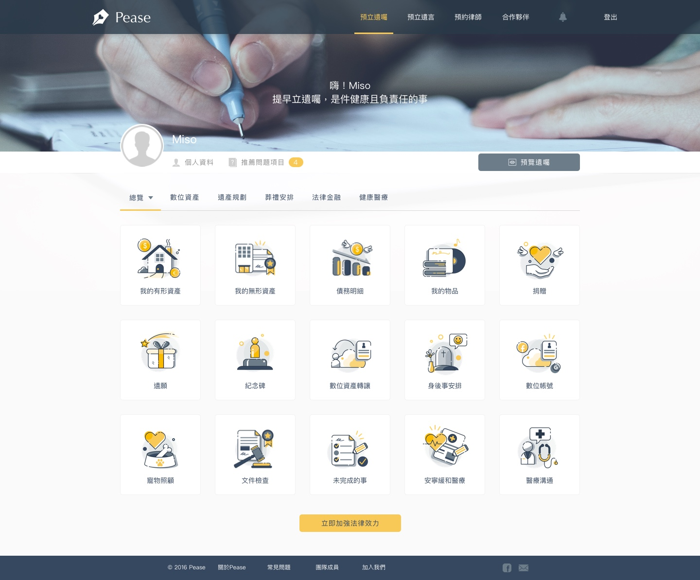
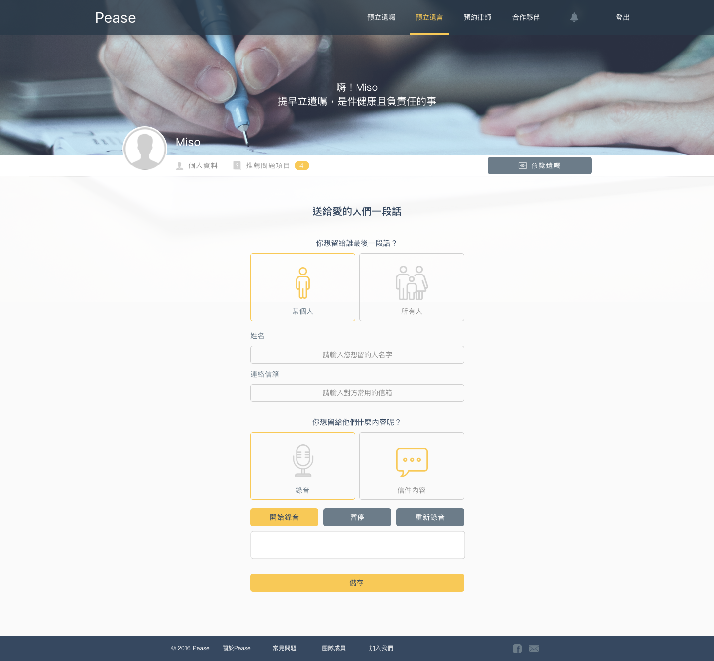

# Pease: Tool for estate planning

This is a project I completed during my training at AlphaCamp. We used 6 weeks to ideate, plan, user-interview, prototype, design and programme the prototype for our presentation. I led a team of 4 people (one UI designer, one backend engineer, one digital marketer and myself).

### Problem
In Taiwan, like other Asian countries, death is a taboo and people are unwilling to talk about it, not to mention plan about it. In order to prepare for it, the general procedure is to find a lawyer and prepare a will. Through our user interviews and landing page, we understand that people are unwilling to find a lawyer to prepare a will mainly because a) it is costly b) it is preferable to do estate planning privately without presence of other people.

### Solution
We established a web application where users can log into an account to prepare their own will. They can change the contents anytime at anywhere without the need to make appointment with a lawyer. Also we have prepared Q&As on commonly-asked questions so that users may prepare their wills smoothly. The UI also make the will preparation process less intimidating as users may avoid reading a lot of texts in order to prepare their will

Also users may make use of the web application to make appointment with a lawyer for a virtual meeting. At the virtual meeting, the lawyer may witness the signing of the will and render the will in the system as legally effective.

### Thoughts
As the product manager, I came across with a lot of problems over the process. For once, we want to focus on the estate planning of digital assets only, including email account, social media accounts. However when we dig deeper, we realised that those websites do not have a thorough mechanism of handling transfer of ownership. Also due to time and technical constraint, we ultimately switch to a simpler idea of ‘will generator’ and I decided to leave out the areas of digital assets.
