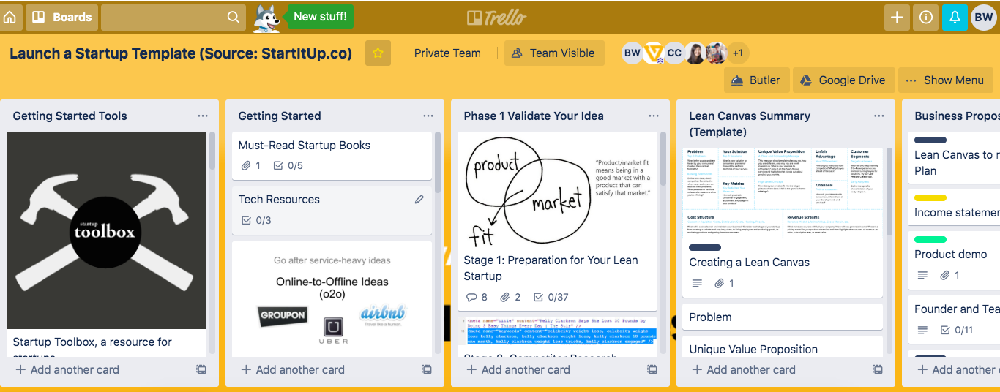
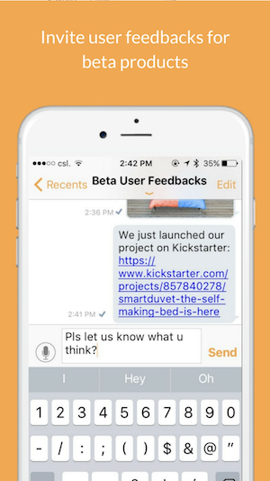

### Varlosity - Startup pre-incubator

This is a project that I was involved in the year of 2017 while I was with Green Tomato. We wanted to launch a pre Incubator product to assist people with start-up idea. I participated as one of the founding team members, responsible for bringing up MVP experiments.

## Problem
We have researched into the startup scenes in Hong Kong and realise that there may be a gap between introductory event like startup weekend and incubation programmes. Therefore we assume that there are people in Hong Kong who are interested in starting a startups but are not well-informed to understand the tech industry . We also expect that the lean startup methodology is well-suited for people in this background. Based on these assumptions and observations, we initiated several MVPs to test out our assumptions.

## MVP

**Trello Training board**

We invite 10 people with a startup idea to join our pilot programme. We designed a ‘curriculum’ and included tasks in the curriculum. We also offered guidance  and During the 4 weeks-time, we give out tasks including market research, user interview, landing page building etc. to these participants. We asked the participants to report their progress through the trello board.

**Startup chatbot**
After We build a mini chatbots with Chatfuel (a chatbot builder). We source questions and answers from Y-Combinator, Quora, Baidu etc and build a simple Q&A chatbot to assess the level of maturity of the startup ideas of users of this chatbot. We also included standardised answers to some common problems to the chatbot. However because of the width of the topic, this MVP didn’t gain too much traction over the test period.

**AMA (Ask me anything) Chat app**

Based on our relatively successful event in startup building workshop, we observed that people preferred interpersonal interaction with one another. We therefore tried to build an online community and organised AMAs in these online communities via a chat app in which members can join in discussion and raise questions in the chat app.

##Thoughts
We observed a steady rise of churn rate over our 3 MVPs, in general all users stopped using any of our MVPs before the end of the testing period. Therefore the team decided to move on to other areas. Some users complained the difficulty in standardising of the process while others claimed they might not have such great determination to start a business even though they started using the MVP. I personally think that it may be difficult to streamline and create a product for innovative actions like creating a startup. Also we might have overestimated people’s determination in starting their own business.
